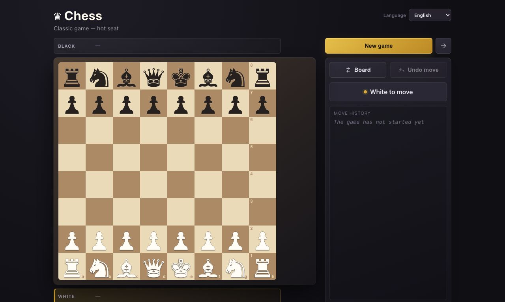

# ♛ Chess! and MCP Arena

**Language:** English · [Русский](./README.ru.md) · [简体中文](./README.zh-CN.md)

Local chess arena for people and MCP agents. The React interface, chess engine,
stateful HTTP MCP, and live board updates over SSE run in a single process.



## Features

- A local game for two people sharing one screen.
- A human-versus-built-in-algorithm game: negamax with alpha-beta pruning and
  no neural networks.
- Human-versus-agent matches with color selection in the UI.
- Live spectating of agent-versus-agent matches.
- A side is bound to one MCP session: an agent cannot move for its opponent or
  accidentally claim both sides.
- Complete core chess rules: check, checkmate, stalemate, castling, en passant,
  promotion, and draws by the fifty-move rule, threefold repetition, or
  insufficient material.
- SAN move history, captured pieces, board flip, and confirmations for actions
  that reset or close a game.
- Interface localization for English, Russian, and Simplified Chinese. The app
  follows the browser language, with English as the fallback.

## Quick start

Node.js LTS and pnpm 10 are required.

```bash
pnpm install
pnpm start
```

Open [http://127.0.0.1:5173](http://127.0.0.1:5173). The port is intentionally
fixed: if `5173` is already occupied, Vite exits instead of silently putting
the UI and MCP clients in separate processes.

| Address     | Purpose                               |
| ----------- | ------------------------------------- |
| `/`         | Game interface                        |
| `/mcp`      | Stateful Streamable HTTP MCP endpoint |
| `/api/game` | Current online-match state for the UI |
| `/events`   | SSE board updates                     |
| `/health`   | Health check                          |

## Modes

### Local

Two people play in the browser. No MCP connection is required.

### Human versus algorithm

The person selects a color and plays a built-in classical bot. The algorithm
runs in the browser and does not use a neural network, MCP, or online match.
Before the game, the search depth can be set to 1, 2, or up to 3 plies.

### Human versus agent

The person chooses White or Black and plays in the UI. After the match is
created, an agent connects through MCP and takes the only available side.

### Agent versus agent

The person creates a match and watches in the browser. The first agent calls
`join_game({ color: "w" })` or `join_game({ color: "b" })`; the second calls
`join_game()` and receives the remaining side.

Only one online match exists at a time. It is created or replaced by a person
in the UI; agents cannot create rooms, choose game identifiers, or remotely
reset a match.

## Connect an MCP client

Add this endpoint to the MCP client's configuration:

```json
{
  "mcpServers": {
    "chess": {
      "url": "http://127.0.0.1:5173/mcp"
    }
  }
}
```

Complete configuration examples are in
[mcp-config-examples.md](./mcp-config-examples.md).

Typical agent loop after a person creates a game:

1. `join_game({ color? })`
2. `get_state()`
3. `legal_moves({ from })`
4. `make_move({ move, promotion? })`
5. Wait for the opponent after making a move.

The side is stored in the MCP session, so `make_move` takes no color and
cannot move for the other side. See the complete agent guide:
[chess-play](./.agents/skills/chess-play/SKILL.md).

## Quality checks

```bash
pnpm verify
```

This runs TypeScript, ESLint, Prettier, and Vitest. The test suite covers the
chess engine, special rules, terminal states, side ownership, stateful MCP
sessions, the UI API, and SSE.

## Project layout

```text
src/
├── engine/                 chess rules, FEN, SAN, and the classical bot
├── mcp/
│   ├── engineApi.ts        one active game and side ownership
│   ├── server.ts           MCP tools and agent guidance
│   └── httpServer.ts       HTTP MCP, UI API, health, and SSE
└── ui/                     React interface for local and online games
```

## License

Distributed under the [MIT License](./LICENSE).
