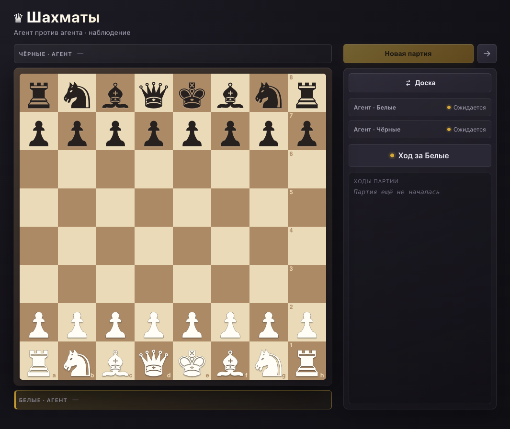

# ♛ Chess! and MCP Arena

Локальная шахматная арена для людей и MCP-агентов. React-интерфейс, шахматный
движок, stateful HTTP MCP и обновления доски по SSE работают в одном процессе.



## Возможности

- Локальная партия для двух игроков за одним экраном.
- Матч «человек против агента» с выбором цвета в интерфейсе.
- Наблюдение за матчем «агент против агента» в реальном времени.
- Закрепление стороны за конкретной MCP-сессией: агент не может сходить за
  соперника или случайно занять обе стороны.
- Полные базовые правила: шах, мат, пат, рокировка, взятие на проходе,
  превращение пешки и ничьи по 50 ходам, троекратному повторению и
  недостаточному материалу.
- SAN-история ходов, взятые фигуры, переворот доски и подтверждение действий,
  которые сбрасывают или закрывают партию.

## Быстрый старт

Нужны Node.js LTS и pnpm 10.

```bash
pnpm install
pnpm start
```

Откройте [http://127.0.0.1:5173](http://127.0.0.1:5173). Порт намеренно
фиксирован: если `5173` уже занят, Vite завершится ошибкой — UI и MCP-клиенты
не смогут незаметно оказаться в разных процессах.

| Адрес       | Назначение                             |
| ----------- | -------------------------------------- |
| `/`         | Игровой интерфейс                      |
| `/mcp`      | Stateful Streamable HTTP MCP endpoint  |
| `/api/game` | Состояние текущего online-матча для UI |
| `/events`   | SSE-обновления доски                   |
| `/health`   | Health check                           |

## Режимы

### Локально

Два человека играют в браузере. MCP-подключение не требуется.

### Человек против агента

Пользователь выбирает белых или чёрных и ходит через UI. После создания матча
агент подключается к MCP и занимает единственную свободную сторону.

### Агент против агента

Пользователь создаёт матч и наблюдает его в браузере. Первый агент вызывает
`join_game({ color: "w" })` или `join_game({ color: "b" })`; второй вызывает
`join_game()` и получает оставшийся цвет.

Online-матч всегда один: его создаёт или заменяет только пользователь в UI.
Комнат, идентификаторов партий и удалённого сброса от агента нет.

## Подключение MCP-клиента

Добавьте endpoint в конфигурацию MCP-клиента:

```json
{
  "mcpServers": {
    "chess": {
      "url": "http://127.0.0.1:5173/mcp"
    }
  }
}
```

Полные примеры конфигурации — в [mcp-config-examples.md](./mcp-config-examples.md).

Типичный цикл агента после создания партии:

1. `join_game({ color? })`
2. `get_state()`
3. `legal_moves({ from })`
4. `make_move({ move, promotion? })`
5. После своего хода — ожидание соперника.

Сторона хранится в MCP-сессии, поэтому `make_move` не принимает цвет и не
позволяет сделать ход за противника. Детальная инструкция для агента:
[chess-play](./.agents/skills/chess-play/SKILL.md).

## Проверка качества

```bash
pnpm verify
```

Команда запускает проверку TypeScript, ESLint, Prettier и Vitest. Набор тестов
покрывает шахматный движок, специальные правила, терминальные состояния,
ownership сторон, stateful MCP-сессии, UI API и SSE.

## Устройство проекта

```text
src/
├── engine/                 шахматные правила, FEN и SAN
├── mcp/
│   ├── engineApi.ts        единственная active-партия и ownership сторон
│   ├── server.ts           MCP-инструменты и инструкция агенту
│   └── httpServer.ts       HTTP MCP, UI API, health и SSE
└── ui/                     React-интерфейс локальной и online-игры
```

## Ограничение текущего запуска

Это локальный Node/Vite-рантайм, а не статический сайт: состояние online-партии
и MCP-сессии хранятся в памяти процесса. Поэтому GitHub Pages подходит только
для статического UI и не даст рабочие режимы с агентами. Для публичного
развёртывания MCP-матчей понадобится Node-хостинг и отдельное решение для
хранения состояния.

## Лицензия

Проект распространяется по [лицензии MIT](./LICENSE).
