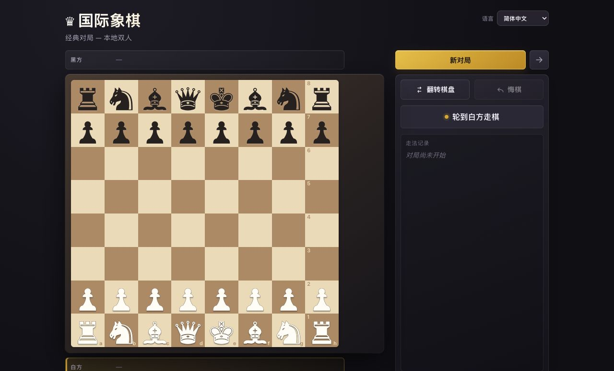

# ♛ Chess! and MCP Arena

**语言：** [English](./README.md) · [Русский](./README.ru.md) · 简体中文

面向玩家和 MCP 智能体的本地国际象棋竞技场。React 界面、棋类引擎、有状态的
HTTP MCP 以及通过 SSE 推送的棋盘更新均运行在同一个进程中。



## 功能

- 两位玩家可在同一屏幕上进行本地对局。
- 支持玩家对内置算法：采用 negamax 和 alpha-beta 剪枝，不使用神经网络。
- 在界面中选择执棋颜色后，玩家可与智能体对弈。
- 可实时观看智能体对智能体的对局。
- 执棋方与单个 MCP 会话绑定：智能体不能替对手走棋，也不能意外占据双方。
- 完整的基础国际象棋规则：将军、将死、逼和、王车易位、吃过路兵、兵升变，
  以及五十回合、三次重复局面和子力不足和棋。
- SAN 走子记录、被吃棋子、翻转棋盘，以及重置或关闭对局前的确认提示。
- 界面支持英语、俄语和简体中文；默认跟随浏览器语言，其他语言回退到英语。

## 快速开始

需要 Node.js LTS 和 pnpm 10。

```bash
pnpm install
pnpm start
```

打开 [http://127.0.0.1:5173](http://127.0.0.1:5173)。端口被有意固定：若
`5173` 已被占用，Vite 会直接退出，避免 UI 和 MCP 客户端在不知情时连接到不同进程。

| 地址        | 用途                                  |
| ----------- | ------------------------------------- |
| `/`         | 对局界面                              |
| `/mcp`      | 有状态的 Streamable HTTP MCP endpoint |
| `/api/game` | 供 UI 使用的当前在线对局状态          |
| `/events`   | SSE 棋盘更新                          |
| `/health`   | 健康检查                              |

## 模式

### 本地对局

两位玩家在浏览器中对弈，无需 MCP 连接。

### 玩家对算法

玩家选择颜色后与内置的经典算法对弈。算法在浏览器中运行，不使用神经网络、MCP 或在线对局。
开始前可将搜索深度设为 1、2 或最多 3 个半回合。

### 玩家对智能体

玩家选择白方或黑方并通过 UI 走棋。创建对局后，智能体通过 MCP 连接并占据唯一
空闲的一方。

### 智能体对智能体

玩家创建对局并在浏览器中观看。第一个智能体调用
`join_game({ color: "w" })` 或 `join_game({ color: "b" })`；第二个智能体调用
`join_game()`，并获得剩余的一方。

同一时间只存在一场在线对局。只能由 UI 中的玩家创建或替换；智能体不能创建房间、
指定对局 ID 或远程重置对局。

## 连接 MCP 客户端

将以下 endpoint 加入 MCP 客户端配置：

```json
{
  "mcpServers": {
    "chess": {
      "url": "http://127.0.0.1:5173/mcp"
    }
  }
}
```

完整配置示例见 [mcp-config-examples.md](./mcp-config-examples.md)。

玩家创建对局后，智能体的典型循环：

1. `join_game({ color? })`
2. `get_state()`
3. `legal_moves({ from })`
4. `make_move({ move, promotion? })`
5. 走完自己的棋后，等待对手。

执棋方保存在 MCP 会话中，因此 `make_move` 不接收颜色参数，也不能替另一方走棋。
完整的智能体指南见：[chess-play](./.agents/skills/chess-play/SKILL.md)。

## 质量检查

```bash
pnpm verify
```

该命令运行 TypeScript、ESLint、Prettier 和 Vitest。测试覆盖棋类引擎、特殊规则、
终局状态、执棋方归属、有状态 MCP 会话、UI API 和 SSE。

## 项目结构

```text
src/
├── engine/                 棋类规则、FEN、SAN 和经典算法
├── mcp/
│   ├── engineApi.ts        唯一活动对局和执棋方归属
│   ├── server.ts           MCP 工具与智能体说明
│   └── httpServer.ts       HTTP MCP、UI API、health 和 SSE
└── ui/                     本地与在线对局的 React 界面
```

## 许可证

项目使用 [MIT License](./LICENSE)。
